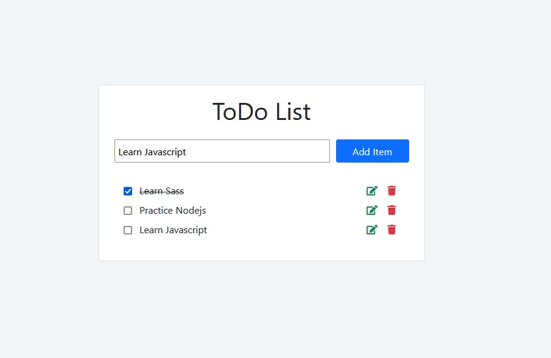

# Simple Node Todo-List

A simple todo-list app made with express

### Version

1.0.0

## Table of Contents

- [General Info](#general-information)
- [Technologies Used](#technologies-used)
- [Screenshot](#screenshot)
- [Usage](#usage)
- [Project Status](#project-status)
- [Room for Improvement](#room-for-improvement)
- [Acknowledgements](#acknowledgements)
- [Contact](#contact)
<!-- * [License](#license) -->

## General Information

This is a simple todo-list. You can add, update and delete items.

## Technologies Used

- Express
- Fetch api
- Handlebars

## Screenshot

## Usage

- Add an item via the form input
- Edit or delete from the list however you like

## Project Status

Project is: _complete_ .

## Room for Improvement

- Push complete task to bottom of all tasks

## Acknowledgements

- This project was inspired by Nicanor.

## Contact

### Author

Oliver Sagala
[Sagspot](https://sagspot.netlify.app/)
